# NYC Bikesharing

### Overview:

#### In this project, we worked with data visualization software "Tableau" to present a business proposal for a bike-sharing company in Des Moines,Iowa. 
#### To do so, we analyzed some key data from a New York Citi Bike-Share dataset. Our first step was to figure out how the bike-share business actually work in New York City, then create a proposal on how we could execute this idea and make it work in Des Moines.

#### Our Tableau Public link is provided below:

[Link: Tableu Public NYC CitiBike Viz](https://public.tableau.com/views/Final-NYCCitiBikeAnalysis/NYCCitibikeStory?:language=en-US&:display_count=n&:origin=viz_share_link)

### Results:

#### Our first task when going through the CSV file containing the data was to convert the "Tripduration" column to a datetime datatype by using the to_datetime() function in Python. In this case, we kept the original column and created a new "Tripduration_DT" column as a datetime type.

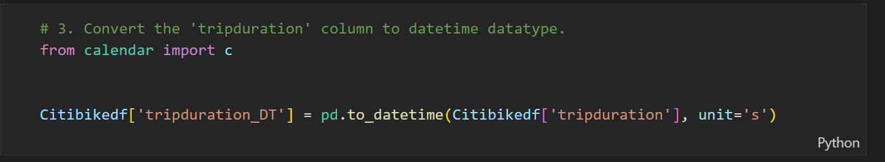

#### Total number of Rides was a little over 2.3 million riders.
* Male riders represented the majority of rides, with a little over 1.5 million rides.
* Female riders were close to 600,000 riders.
* And Unknown "gender" totalled around 225,000 rides.

[Link to Gender Breakdown Viz:](https://public.tableau.com/views/Final-NYCCitiBikeAnalysis/GenderBreakdown?:language=en-US&:display_count=n&:origin=viz_share_link)

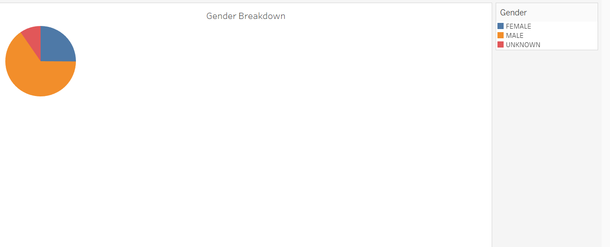

#### In the below pictures, we displayed the top starting and ending locations for the bike sharing program in NYC. 
#### The darker and larger circles represent the busiest Starting and Ending Locations.
#### We can determine that most of the busier areas are touristic areas, which in return helps with the high demand for the shared bikes.
#### We also notice that most starting and ending locations are pretty close to each other and in several points the same, this indicates that customers are using the bikes from and to the original place they were picked up from, maybe around hotels, restaurants and common places. 

[Link to Top Starting Locations:](https://public.tableau.com/views/Final-NYCCitiBikeAnalysis/TopStartingLocations?:language=en-US&:display_count=n&:origin=viz_share_link)

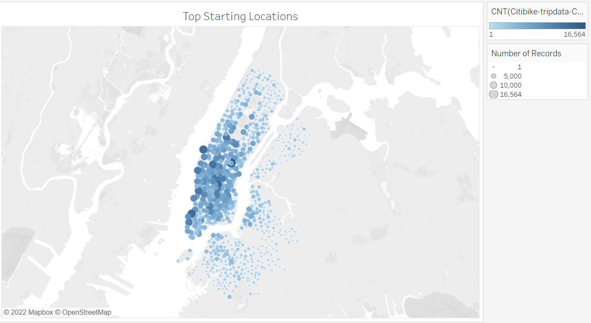

[Link to Top Ending Locations:](https://public.tableau.com/shared/PBK7F2DHJ?:display_count=n&:origin=viz_share_link)

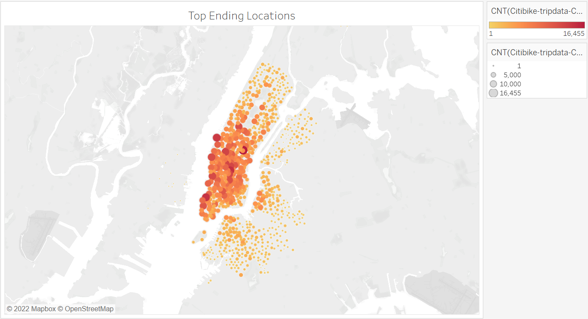

#### We also gather from the below picture that most of the rides do not take longer than 10min.
#### Based on the attached image, as well as the below Vix link, the typical rented bike is checked out for 10min in most cases, and almost all rides are within less than an hour.

[Link to Checkout Times for Users:](https://public.tableau.com/shared/DQZ5PST8Z?:display_count=n&:origin=viz_share_link)

#### We created another vizualisation for the same checkout times, but based on gender. We clearly see that checkout times are mainly similar between males and females, but male riders are the primarly riders.

[Link to Checkout Times by Gender:](https://public.tableau.com/shared/2R6CTM5SJ?:display_count=n&:origin=viz_share_link)

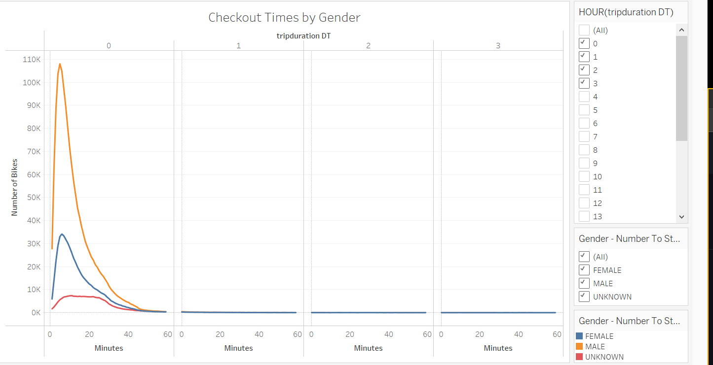

#### When we look at the trips by weekday for each hour, we notice that most of the rides are taken between 8-10am in the morning and 5-7pm in the evening time, most days of the week.
#### However we see a different trend during weekends, during which trips are more scattered throughout the days, and no peak specific time range.

[Link to Trips by Weekday for Each Hour:](https://public.tableau.com/shared/J5KZXH759?:display_count=n&:origin=viz_share_link)

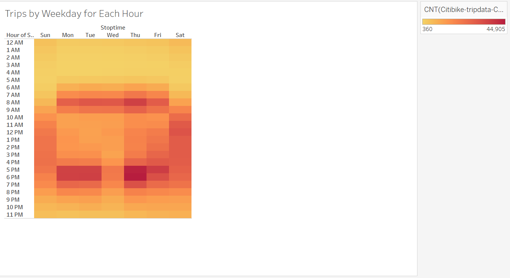

[Link to Trips by Gender by Weekday per Hour:](https://public.tableau.com/shared/BPSKP6YJ3?:display_count=n&:origin=viz_share_link)

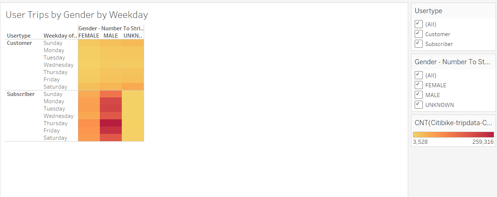

#### The image below shows that male riders represent the highest number of subscribers to the program, and their contribution average is way above the female customers.
#### We also see that the number of subscribers exceeds other customers.

[Link to User Trips by Gender by Weekday:](https://public.tableau.com/shared/WJYM3NM8W?:display_count=n&:origin=viz_share_link)

#### Our Top Three used bikes based on their trip durations are listed here,
* Number 1: Bike ID 39570, with a total trip duration of 3,838,467s.
* Number 2: Bike ID 17551, trip duration of 3,381,357s.
* Number 3: Bike ID 17947, trip duration of 2,740,691s.

[Link to Bike Utilization:](https://public.tableau.com/shared/X9CHKSJ4C?:display_count=n&:origin=viz_share_link)

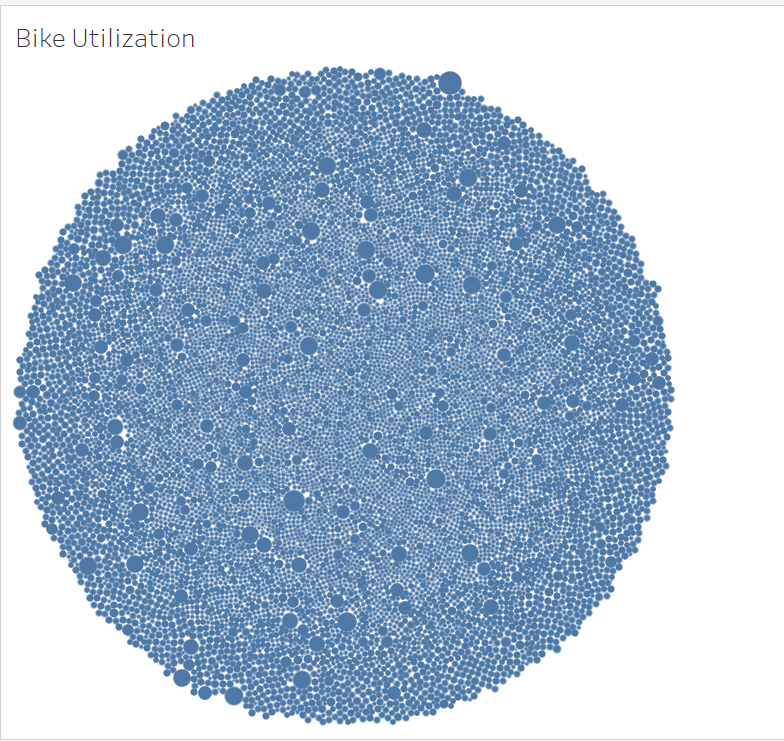

#### Below is a link to our NYC Analysis Dashboard.

[Link to CityBike Dashboard:](https://public.tableau.com/shared/2J4YGHW37?:display_count=n&:origin=viz_share_link)

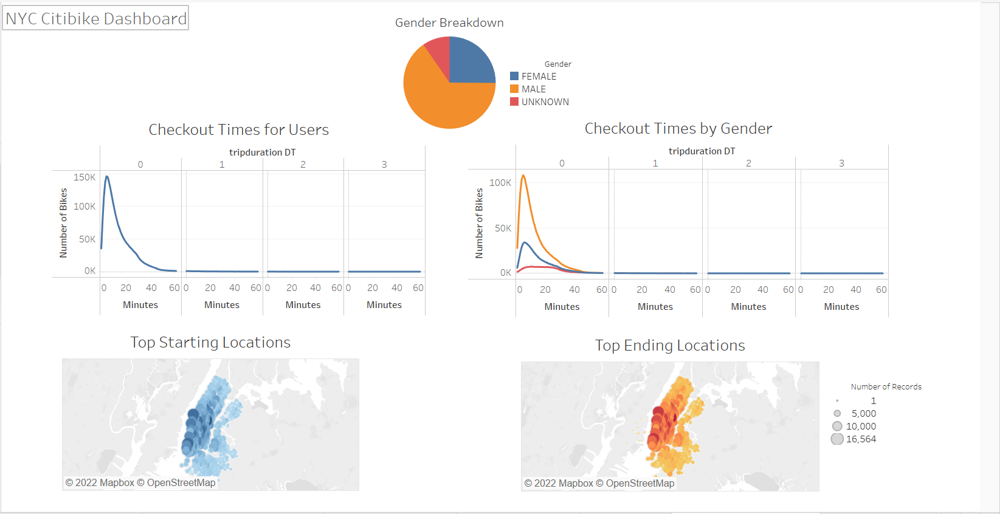

### Summary:

#### The above listed information and our analysis clearly confirms the success of the Bike Share concept in NYC, which is very encouraging to us and hopefully to our angel investors.
#### NYC is a one of the world's top touristic destinations, which has helped ultimately grow the bike share program, in addition to the structure of the city, its architecture and even condensation of drivers and traffic.
#### Our busiest times of the week day are between 8am and 9am, then 5pm till 7pm, and subscribers contribute the most to the bike rentals during these times. This explain that many professionals are using the CitiBike Share tool to commute back and forth to work.
#### While all of the above factors are in favor of the concept success, we can't unfortunately confirm the same for Des Moines, Iowa. Many of the reasons that have made this program successful in NYC can't be promised for Des Moines, mainly the touristic destinations and the daily commuters, due to proximity to work and similar challenges.

#### If we wanted to add couple more vizualisations, we could have gathered more data from the company that will help us vizualise what profit each bike presents to the company, considering their generated income, cost of maintenance and bike utilization.
#### Another vizualisation that we could present, with available data, would be regaring our busiest starting stations, to ensure available inventory of bikes is always present for customers. Please see below.

[Link to Rides By Station:](https://public.tableau.com/views/Final-NYCCitiBikeAnalysis/RidesperStation?:language=en-US&publish=yes&:display_count=n&:origin=viz_share_link)
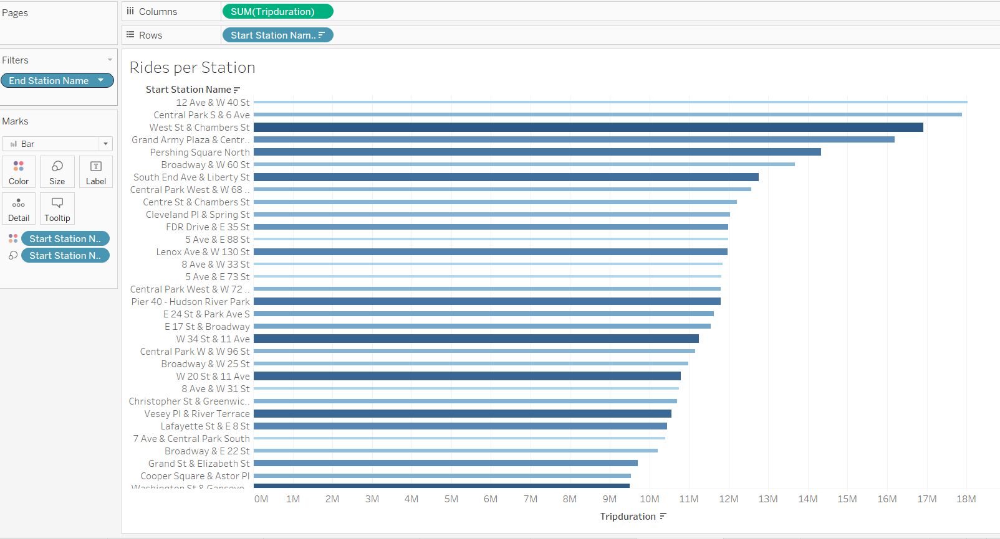

#### We could also create a chart vizualising how many rides are taken depending on birth year, which could help us understand better the demographics of our potential customers, but unfortunately in this case the chart doesn't provide clear understanding of this notion. For instance the birth year 1969 is showing the longest trip duration associated with it, and we are not sure if this value is accurate, especially when we don't know how customers and subscribers enter their personal information and if it is confirmed by CitiBike at any point.

[Link to Rides By Age:](https://public.tableau.com/views/Final-NYCCitiBikeAnalysis/RidesbyAge?:language=en-US&publish=yes&:display_count=n&:origin=viz_share_link)
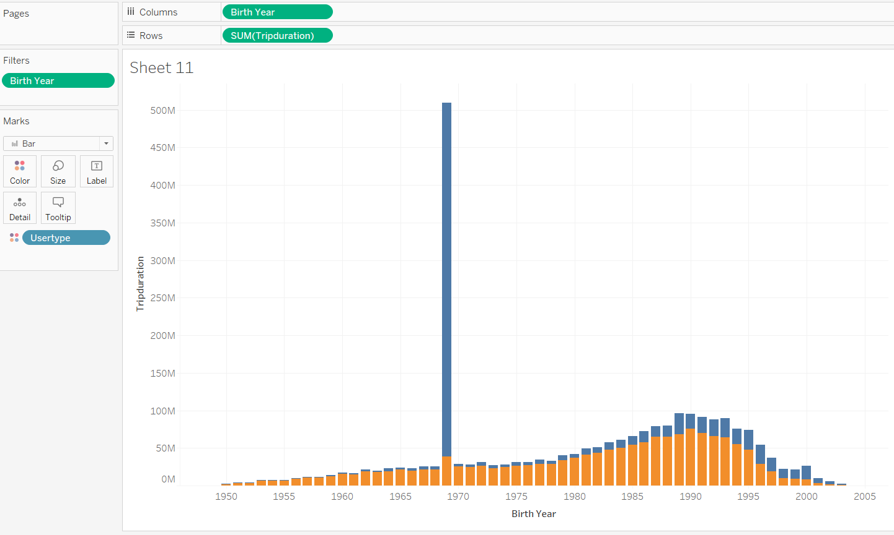